<!--
  ┌──────────────────────────────────────────────────────────────────┐
  │  Du liest den Quelltext eines README.                            │
  │  Das ist entweder Neugier oder OPSEC. Beides wird akzeptiert.    │
  │                                                                  │
  │  $ cat .secret                                                   │
  │  L4RP was here.                                                  │
  │                                                                  │
  │  Die Terminals sind generiert, nicht handgeschrieben:            │
  │      python tools/gen_terminal_svg.py                            │
  │  Text aendern -> in tools/gen_terminal_svg.py bei SCENES.        │
  └──────────────────────────────────────────────────────────────────┘
-->

<p align="center">
  
</p>

<p align="center">
  
</p>


## `// 01` whoami

```
NAME     : L4RP
ROLE     : builds things that boot
DISTRO   : Arch Linux (yes, that is a personality trait)
LANG     : Python, Shell, a regrettable amount of Batch
DOING    : turning "just install Arch" into a wizard anyone can click
DEBUG    : print statements, exclusively
TESTING  : ship it, the users will find them
STATUS   : it compiled, therefore it works
CONTACT  : open an issue, that is what they are for
```

I mostly build tooling — the boring layer between "this is possible" and
"a normal person can actually do it". Currently that means packaging Arch
Linux into something you can hand to someone without a two-hour phone call.


## `// 02` stack

<p align="center">
  
</p>

```
drwxr-xr-x  l4rp  python      main driver — CLI, GUI, build pipelines
drwxr-xr-x  l4rp  bash        glue, installers, anything with a shebang
drwxr-xr-x  l4rp  linux       arch, systemd, squashfs, mkinitcpio
drwxr-xr-x  l4rp  windows     WSL bridges, batch launchers, PowerShell
drwxr-xr-x  l4rp  git         branches are cheap, force-push is not
-rwxr-xr-x  l4rp  stackover~  copy-paste, attribution optional
-rw-r--r--  l4rp  docs        planned. always planned.
-rw-------  root  opsec       permission denied
```


## `// 03` daemons

<p align="center">
  
</p>

<p align="center">
  
</p>


## `// 04` review

<p align="center">
  
</p>


## `// 05` telemetry

<p align="center">
  
</p>

<sub>Selbst erzeugt aus der GitHub-API — kein externer Badge-Dienst, der
ausfallen kann. Aktualisiert sich woechentlich per Action.</sub>


## `// 06` payloads

<p align="center">
  
</p>

<sub>Aus der GitHub-API erzeugt — die Liste bleibt aktuell, ohne dass ich
sie hier von Hand nachpflege.</sub>


<p align="center">
  
</p>

<!--
  Noch hier? Dann verdienst du das hier:

      $ echo $?
      0

  Alles in Ordnung. Immer gewesen.
-->
