<!--
  ┌──────────────────────────────────────────────────────────────────┐
  │  Du liest den Quelltext eines README.                            │
  │  Das ist entweder Neugier oder OPSEC. Beides wird akzeptiert.    │
  │                                                                  │
  │  $ cat .secret                                                   │
  │  L4RP was here.                                                  │
  │                                                                  │
  │  Die Terminals sind generiert, nicht handgeschrieben:            │
  │      python tools/gen_terminal_svg.py                            │
  │  Text aendern -> in tools/gen_terminal_svg.py bei SCENES.        │
  └──────────────────────────────────────────────────────────────────┘
-->

<p align="center">
  
</p>

---

## `$ cat about.txt`

```
NAME     : L4RP
ROLE     : builds things that boot
DISTRO   : Arch Linux (yes, that is a personality trait)
LANG     : Python, Shell, a regrettable amount of Batch
DOING    : turning "just install Arch" into a wizard anyone can click
DEBUG    : print statements, exclusively
TESTING  : ship it, the users will find them
STATUS   : it compiled, therefore it works
CONTACT  : open an issue, that is what they are for
```

I mostly build tooling — the boring layer between "this is possible" and
"a normal person can actually do it". Currently that means packaging Arch
Linux into something you can hand to someone without a two-hour phone call.

---

## `$ ls -la ~/stack`

<p align="center">
  
</p>

```
drwxr-xr-x  l4rp  python      main driver — CLI, GUI, build pipelines
drwxr-xr-x  l4rp  bash        glue, installers, anything with a shebang
drwxr-xr-x  l4rp  linux       arch, systemd, squashfs, mkinitcpio
drwxr-xr-x  l4rp  windows     WSL bridges, batch launchers, PowerShell
drwxr-xr-x  l4rp  git         branches are cheap, force-push is not
-rwxr-xr-x  l4rp  stackover~  copy-paste, attribution optional
-rw-r--r--  l4rp  docs        planned. always planned.
-rw-------  root  opsec       permission denied
```

---

## `$ tail -f /var/log/*`

<p align="center">
  
</p>

<p align="center">
  
</p>

---

## `$ sudo pacman -Syu`

<p align="center">
  
</p>

---

## `$ wsl --list --verbose`

Das Projekt baut Arch-ISOs — auch von Windows aus. Die PowerShell ist
dabei ehrlich gesagt nur der Bootloader.

<p align="center">
  
</p>

---

## `$ git log --stat`

<p align="center">
  
</p>

<sub>Selbst erzeugt aus der GitHub-API — kein externer Badge-Dienst, der
ausfallen kann. Aktualisiert sich woechentlich per Action.</sub>

---

## `$ ls ~/projects`

### [`Easy-Arch-Linux`](https://github.com/Peter362187/Easy-Arch-Linux)

```
$ ./easy-arch --help

  Graphical builder for custom Arch Linux live ISOs.
  Click through a wizard — desktop, kernel, apps, network,
  branding — and get a bootable ISO out the other end.

  runs on   : Arch (native) · Windows (WSL) · Linux/macOS (container)
  written in: Python · Shell · Batch
  language  : German interface
  status    : active
```

---

## `$ cat /dev/urandom | head -c 64`

<details>
<summary><code>$ dmesg | tail</code></summary>

```
[    0.000000] Linux version 6.11.4-arch (l4rp@localhost)
[    0.421337] ACPI: coffee subsystem initialised
[    1.337000] systemd[1]: Reached target Mildly Productive.
[    2.718281] opsec: module loaded, verbosity=0
[    3.141592] usb 1-1: new device found, idVendor=dead, idProduct=beef
[    4.000000] EXT4-fs (sda2): mounted filesystem with ordered data mode
[    5.550000] hypergamie: module loaded, refcount=1, cannot unload
[    8.675309] hypervisor: nested virtualisation detected, we must go deeper
[   13.370000] motivation[1337]: segfault at 0900 ip 00007f caffeine not found
[   21.000000] systemd[1]: motivation.service: scheduled restart
[   42.000000] localhost: answer computed, question lost
```

</details>

<details>
<summary><code>$ sudo -l</code></summary>

```
User l4rp may run the following commands on localhost:

    (ALL : ALL) NOPASSWD: /usr/bin/pacman -Syu
    (ALL : ALL) NOPASSWD: /usr/bin/systemctl restart *
    (ALL : ALL) NOPASSWD: /usr/local/bin/blame-the-cache
    (root)      PASSWD:   /usr/bin/rm -rf /
                          ^ this one asks twice. on purpose.
```

</details>

<details>
<summary><code>$ systemctl --failed</code></summary>

```
  UNIT                     LOAD   ACTIVE SUB    DESCRIPTION
* confidence.service       loaded failed failed Confidence Daemon
* sleep-schedule.service   loaded failed failed Sleep Schedule
* documentation.timer      loaded failed failed Write The Docs
* backup.service           loaded failed failed Backups (since 2024)

4 loaded units listed.
"it works on my machine" is not a valid unit type.
```

</details>

<details>
<summary><code>$ cat ~/.bash_history | sort | uniq -c | sort -rn | head</code></summary>

```
    482  ls
    377  cd ..
    291  clear
    244  sudo !!
    198  git status
    161  sudo pacman -Syu
    143  reboot
     97  vim            (davon per pkill beendet: 61)
     54  man man
     12  sudo pacman -Rns $(pacman -Qtdq)
              ^ fuehlte sich maechtig an. war es nicht.
```

</details>

<details>
<summary><code>$ history | grep -c "arch"</code></summary>

```
2847

$ history | grep "why"
  201  why is it not booting
  388  why does grub hate me
  512  why did that work
  977  why did I touch it again
```

</details>

---

```
user@github:~$ exit
logout
Connection to localhost closed.
```

<!--
  Noch hier? Dann verdienst du das hier:

      $ echo $?
      0

  Alles in Ordnung. Immer gewesen.
-->
